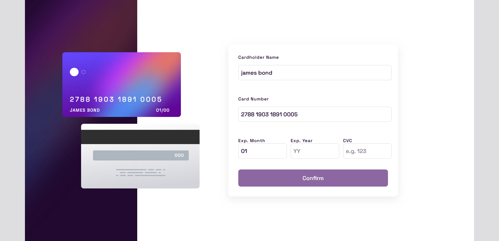
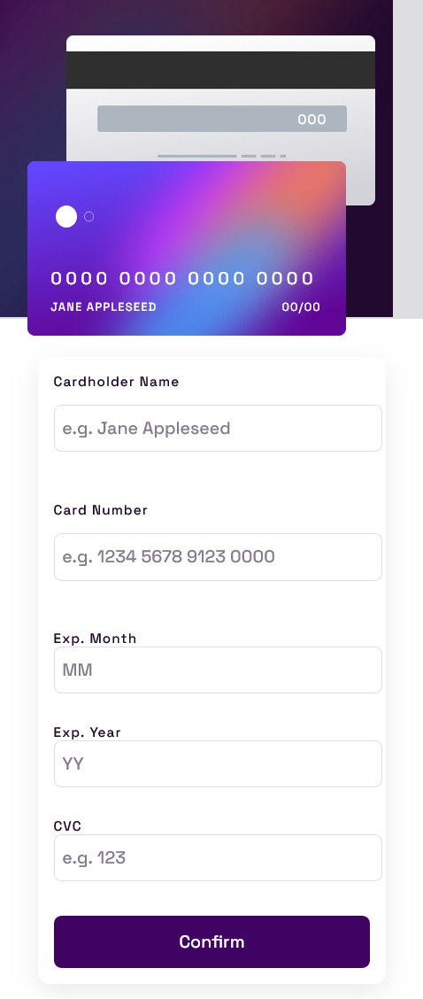
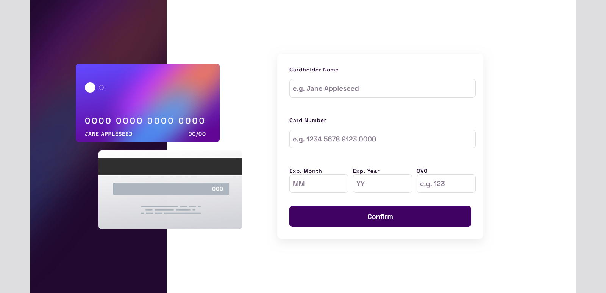
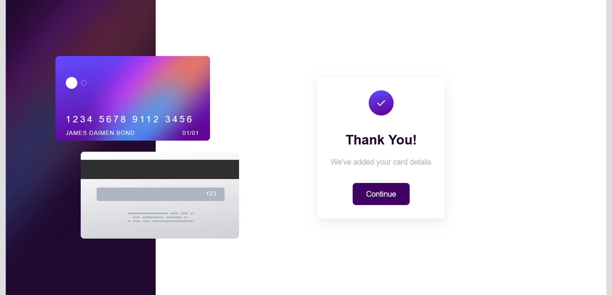
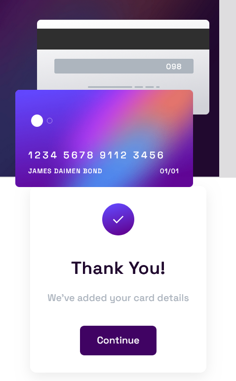

# Frontend Mentor - Interactive card details form solution

This is a solution to the [Interactive card details form challenge on Frontend Mentor](https://www.frontendmentor.io/challenges/interactive-card-details-form-XpS8cKZDWw). Frontend Mentor challenges help one improve one's coding skills by building realistic projects. 

## Table of contents

- [Overview](#overview)
  - [The challenge](#the-challenge)
  - [Screenshot](#screenshot)
  - [Links](#links)
- [My process](#my-process)
  - [Built with](#built-with)
  - [What I learned](#what-i-learned)
  - [Continued development](#continued-development)
  - [Useful resources](#useful-resources)
- [Author](#author)
- [Acknowledgments](#acknowledgments)

## Overview

### The challenge

Users should be able to:

- Fill in the form and see the card details update in real-time
- Receive error messages when the form is submitted if:
  - Any input field is empty
  - The card number, expiry date, or CVC fields are in the wrong format
- View the optimal layout depending on their device's screen size
- See hover, active, and focus states for interactive elements on the page

### Screenshot

Destop View




Mobile View




Active State View




Complete State desktop View




Complete State In Mobile View




### Links

- Solution URL: [Gthub repository URL](https://github.com/Andre0307J/interractive-kard-project)
- Live Site URL: [Vercel App URL](https://interractive-kard-project.vercel.app/)

## My process

I started by analyzing the project requirements and designing the layout using HTML and CSS. I used Flexbox and CSS Grid to create a responsive card form interface. After setting up the structure, I focused on overlaying the card elements and ensuring the cards could overflow their container for a realistic effect.

Next, I implemented the form functionality with JavaScript, including real-time updates to the card details and formatting the card number input. I also added validation to provide user feedback for incorrect or incomplete inputs. Finally, I styled the completed state that appears after successful form submission.

Throughout the project, I referred to documentation and online resources to solve layout and formatting challenges.

### Built with

- Semantic HTML5 markup
- Pure CSS (no frameworks)
- CSS custom properties
- Flexbox
- CSS Grid
- Vanilla JavaScript


### What I learned

- I learned how to overlay text on images using CSS and how to make image objects overlap their containers.
- I learned how to hide specific sections of HTML and display them only when a button is clicked, using both CSS and JavaScript.
- I also learned how to format card numbers dynamically using JavaScript.

Below are code snippets demonstrating how text is written on the card image and how the card overlaps its container:

```html
<!-- Left-column Section -->
<section class="left-column">
        
        <div class="cards">
          
          <div class="card-front-info">
            <span class="card-number">0000 0000 0000 0000</span>
            <span class="card-name">Jane Appleseed</span>
            <span class="card-expiry"
              ><span class="card-month">00</span>/<span class="card-year">00</span
            ></span>
          </div>
          
          <div class="card-back-info">
            <span class="card-cvc">000</span>
          </div>
        </div>
      </section>
```
```css
.left-column {
  position: relative;
  display: flex;
  align-items: center;
  justify-content: flex-end; /* Push cards to the right edge */
  overflow: visible; /* Allow cards to overflow */
}

.background-img {
  position: absolute;
  top: 0;
  left: 0;
  width: 100%;
  height: 100%;
  object-fit: cover;
  z-index: 1;
}

.cards {
  position: relative;
  width: 400px;
  height: 300px;
  margin-right: -120px; /* This will make the cards overlap into the right column */
}

.card-front {
  position: absolute;
  top: -70px;
  left: 2.5rem;
  width: 380px;
  z-index: 2;
}

.card-front-info {
  position: absolute;
  top: 48px; 
  left: 4rem;
  width: 320px;
  z-index: 3;
  display: flex;
  flex-direction: column;
  gap: 12px;
  pointer-events: none;
}

.card-number {
  font-size: 22px;
  color: #fff;
  letter-spacing: 4px;
  font-family: "Space Grotesk", sans-serif;
  font-weight: 500;
}

.card-name,
.card-expiry {
  font-size: 14px;
  color: #fff;
  font-family: "Space Grotesk", sans-serif;
  font-weight: 500;
  letter-spacing: 1px;
}

.card-expiry {
  position: absolute;
  right: 0;
  bottom: 0;
}

.card-back {
  position: absolute;
  top: 160px;
  left: 100px;
  width: 380px;
  z-index: 2;
}

.card-back-info {
  position: absolute;
  top: 250px; 
  left: 400px;
  z-index: 3;
  pointer-events: none;
}
```
Code snippets which shows the completed state which its display is triggered after form has been submitted are below with its CSS and JavaScript:

```html
<!-- Completion state will be shown here after submit -->
  <div class="complete-state">
    
      <h2>Thank You!</h2>
      <p>We've added your card details</p>
      <button class="continue-btn">Continue</button>
  </div>
```
```css
.complete-state {
  display: none;
  flex-direction: column;
  align-items: center;
  justify-content: center;
  gap: 1.5rem;
  padding: 2rem;
  background: hsl(0, 100%, 100%);
  border-radius: 12px;
  box-shadow: 0 8px 24px rgba(0, 0, 0, 0.08);
}

.complete-icon {
  width: 60px;
  margin-bottom: 1rem;
}

.complete-state h2 {
  font-size: 2rem;
  color: hsl(278, 68%, 11%);
  margin: 0;
}

.complete-state p {
  font-size: 18px;
  color: hsl(212, 12%, 71%);
  margin: 0;
}

.continue-btn {
  padding: 1rem 2rem;
  font-size: 18px;
  font-family: inherit;
  font-weight: 500;
  background: linear-gradient(90deg, hsl(278, 94%, 20%));
  color: #fff;
  border: none;
  border-radius: 8px;
  cursor: pointer;
  margin-top: 1rem;
}
.confirm-btn {
  padding: 1rem;
  font-size: 18px;
  font-family: inherit;
  font-weight: 500;
  background: linear-gradient(90deg, hsl(278, 94%, 20%));
  color: #fff;
  border: none;
  border-radius: 8px;
  cursor: pointer;
  opacity: 0.6;
  transition: opacity 0.2s;
}

.confirm-btn:enabled {
  opacity: 1;
  cursor: pointer;
}
```
```js
// Confirm button (form submission)
  form.addEventListener("submit", function (e) {
    e.preventDefault();
    const isValid = validateForm(true); // Show all errors
    if (!isValid) return;

    form.style.display = "none";
    document.querySelector(".complete-state").style.display = "flex";
  });
```

Javascript function code snippet which shows how card number are formatted ia below:

```js
// format card number
function formatCardNumber(value) {
    return value
      .replace(/\D/g, "")
      .replace(/(.{4})/g, "$1 ")
      .trim();
  }
```  
### Continued development

Going forward, I'd like to continue focusing on improving my CSS skills especially on the area of using the Flexbox and Grids. As for JavaScript, despite form validations, I'd also would like to improve on my skills and learn more about animations. I tried animating the cards when the focus is on inputing information on the back card. The intent was that the front card flips when the focus is on input fields in which the data which would be inputted BUT each time i try that, the whole text doesn't align properly. So i abandoned the idea for now.

### Useful resources

- [MDN Web Docs: Flexbox](https://developer.mozilla.org/en-US/docs/Web/CSS/CSS_Flexible_Box_Layout/Basic_Concepts_of_Flexbox) – Helped me understand and implement flexible layouts for card positioning.
- [MDN Web Docs: overflow](https://developer.mozilla.org/en-US/docs/Web/CSS/overflow) – Clarified how to allow elements (like cards) to overflow their containers.
- [MDN Web Docs: String.prototype.replace()](https://developer.mozilla.org/en-US/docs/Web/JavaScript/Reference/Global_Objects/String/replace) – Used for formatting the card number input.
- [CSS Tricks: Absolute, Relative, Fixed Positioning](https://css-tricks.com/absolute-relative-fixed-positioining-how-do-they-differ/) – Helped with overlaying cards using CSS positioning.

## Author

- Name: Ozomma Chukwuemeka Andre, an aspiring frontend developer.

## Acknowledgments

- Thanks to GitHub Copilot for providing coding suggestions and guidance during development.
